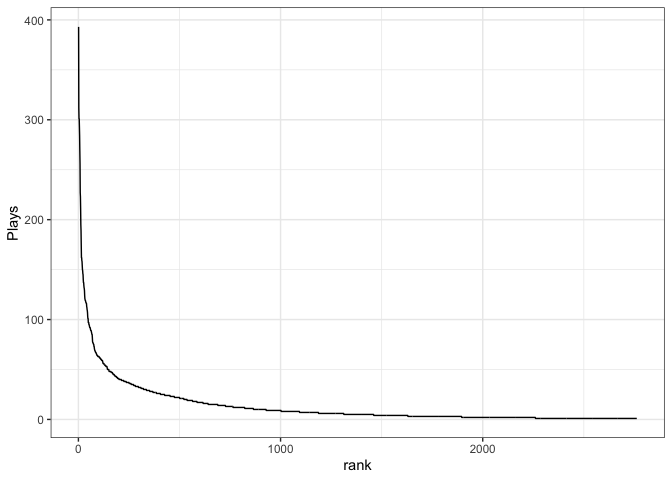

Song plays
================

``` r
songs <- read.csv(here::here("05_simple_metrics", "rmd_music.csv")) %>%
  mutate(rank = dplyr::row_number())

head(songs)
```

    ##                         Title Time             Artist
    ## 1 Dark Bird (St. Lucia Remix) 4:44 Jake Wesley Rogers
    ## 2                    Delicate 3:52       Taylor Swift
    ## 3        Almost (Sweet Music) 3:37             Hozier
    ## 4                  The Archer 3:31       Taylor Swift
    ## 5                       Angel 4:54      Fleetwood Mac
    ## 6                       Clean 4:31       Taylor Swift
    ##                                  Album       Genre Heart Plays rank
    ## 1 Dark Bird (St. Lucia Remix) - Single         Pop     0   393    1
    ## 2                           reputation         Pop     0   312    2
    ## 3                     Wasteland, Baby! Alternative     0   301    3
    ## 4                                Lover         Pop     0   301    4
    ## 5                    Tusk (Remastered)        Rock     0   293    5
    ## 6                1989 (Deluxe Edition)         Pop     0   284    6

``` r
ggplot(songs, aes(rank, Plays)) +
  geom_line()
```

<!-- -->
