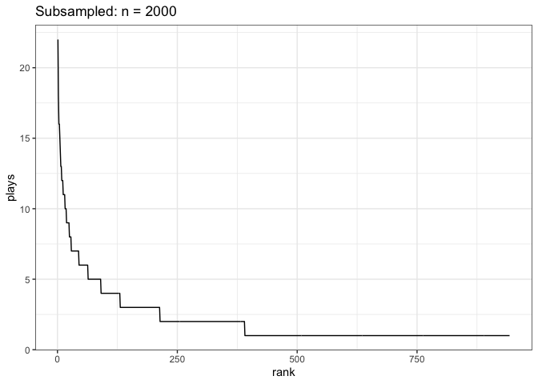

Song plays
================

``` r
songs <- read.csv(here::here("05_simple_metrics", "song_plays.csv"))

head(songs)
```

    ##                          song rank plays
    ## 1 Dark Bird (St. Lucia Remix)    1   393
    ## 2                    Delicate    2   312
    ## 3        Almost (Sweet Music)    3   301
    ## 4                  The Archer    4   301
    ## 5                       Angel    5   293
    ## 6                       Clean    6   284

Richness (number of songs): 2755

Abundance (number of plays): 0

``` r
ggplot(songs, aes(rank, plays)) +
  geom_line()
```

<!-- -->

### Summary stats:

``` r
songs_summary <- songs %>%
  summarize(hill_0 = hill_taxa(plays, q = 0),
         hill_1 = hill_taxa(plays, q = 1),
         hill_2 = hill_taxa(plays, q = 2))

songs_summary
```

    ##   hill_0   hill_1   hill_2
    ## 1   2755 1139.369 577.9806

## Subsampling

The song plays data is exhaustive: Apple Music knows every song I’ve
played for the past year.

What if we randomly observed a subsample of songs?

``` r
sample_size = 2000

sampled_songs <- data.frame(
  song_id = sample.int(nrow(songs), size = sample_size, prob = songs$plays / sum(songs$plays), replace = T)) %>%
  group_by(song_id) %>%
  tally() %>%
  ungroup() %>%
  arrange(desc(n)) %>%
  mutate(rank = dplyr::row_number()) %>%
  rename(plays = n)


ggplot(sampled_songs, aes(rank, plays)) +
  geom_line() +
  ggtitle(paste0("Subsampled: n = ", sample_size))
```

<!-- -->

``` r
sampled_songs_summary <- sampled_songs %>%
  summarize(hill_0 = hill_taxa(plays, q = 0),
         hill_1 = hill_taxa(plays, q = 1),
         hill_2 = hill_taxa(plays, q = 2))

sampled_songs_summary
```

    ## # A tibble: 1 × 3
    ##   hill_0 hill_1 hill_2
    ##    <int>  <dbl>  <dbl>
    ## 1    943   672.   453.
