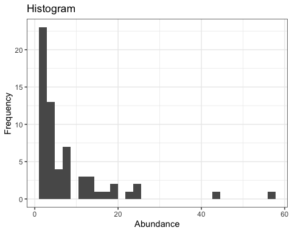

Simple metrics of biodiversity demonstrations
================

-   <a href="#data" id="toc-data">Data</a>
-   <a href="#visualizing-sads" id="toc-visualizing-sads">Visualizing
    SADs</a>
    -   <a href="#histogram" id="toc-histogram">Histogram</a>
    -   <a href="#rank-abundance-plot"
        id="toc-rank-abundance-plot">Rank-abundance plot</a>
    -   <a href="#cumulative-distribution-function"
        id="toc-cumulative-distribution-function">Cumulative distribution
        function</a>
-   <a href="#fitted-distributions" id="toc-fitted-distributions">Fitted
    distributions</a>
-   <a href="#summary-statistics" id="toc-summary-statistics">Summary
    statistics</a>

## Data

Get an SAD (here, using the `meteR::arth` data; substitute here to use a
different community)

``` r
sad_long <- meteR::arth

sad_counts <- sad_long %>%
  group_by(spp) %>%
  tally() %>%
  arrange(desc(n)) %>%
  mutate(rank = dplyr::row_number()) %>%
  rename(abundance = n) %>%
  select(rank, abundance)

head(sad_counts)
```

    ## # A tibble: 6 × 2
    ##    rank abundance
    ##   <int>     <int>
    ## 1     1        73
    ## 2     2        52
    ## 3     3        33
    ## 4     4        28
    ## 5     5        25
    ## 6     6        24

## Visualizing SADs

### Histogram

``` r
sad_histogram <- ggplot(sad_counts, aes(abundance)) +
  geom_histogram() +
  xlab("Abundance") +
  ylab("Frequency") +
  ggtitle("Histogram")

sad_histogram
```

    ## `stat_bin()` using `bins = 30`. Pick better value with `binwidth`.

<!-- -->

### Rank-abundance plot

``` r
sad_rankplot <- ggplot(sad_counts, aes(rank, abundance)) +
  geom_point() +
  geom_line() +
  xlab("Rank") +
  ylab("Abundance") +
  ggtitle("Rank-abundance plot")


sad_rankplot
```

<!-- -->

``` r
sad_rankplot_log <- ggplot(sad_counts, aes(log(rank), log(abundance))) +
  geom_point() +
  geom_line() +
  xlab("Rank (log)") +
  ylab("Abundance (log)") +
  ggtitle("Rank-abundance plot (log-log)") 


sad_rankplot_log
```

<!-- -->

### Cumulative distribution function

``` r
sad_ecdf <- ecdf(sad_counts$abundance)

sad_counts <- sad_counts %>%
  mutate(cdf = sad_ecdf(abundance))

cdf_plot <- ggplot(sad_counts, aes(abundance, cdf)) + 
  geom_point() +
  geom_line() +
  xlab("Abundance") +
  ylab("Cumulative density") +
  ggtitle("CDF")

cdf_plot
```

<!-- -->

``` r
cdf_plot_log <- ggplot(sad_counts, aes(log(abundance), cdf)) + 
  geom_point() +
  geom_line() +
  xlab("Abundance (log)") +
  ylab("Cumulative density") +
  ggtitle("CDF (log)")

cdf_plot_log
```

<!-- -->

## Fitted distributions

## Summary statistics

-   Richness
-   Evenness/diversity

------------------------------------------------------------------------

-   Hill numbers

<https://cran.r-project.org/web/packages/hillR/hillR.pdf>
