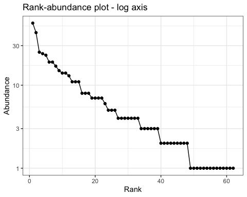
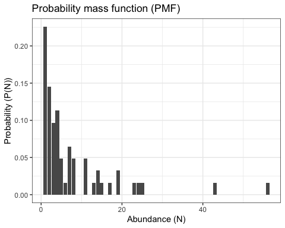
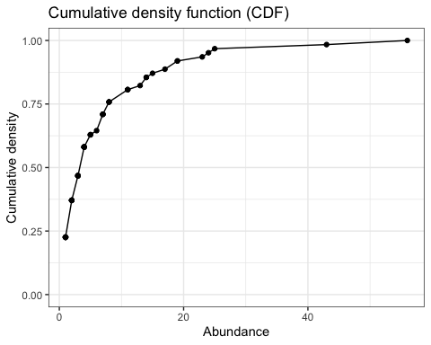
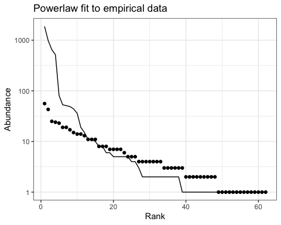
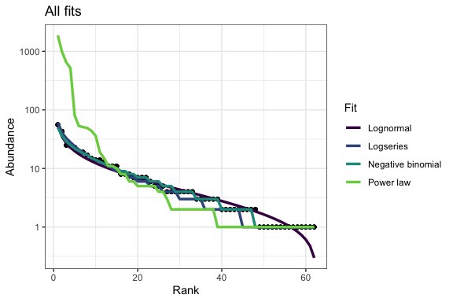

Simple metrics of biodiversity demonstrations
================

-   <a href="#data" id="toc-data">Data</a>
-   <a href="#visualizing-sads" id="toc-visualizing-sads">Visualizing
    SADs</a>
    -   <a href="#histogram" id="toc-histogram">Histogram</a>
    -   <a href="#pmf" id="toc-pmf">PMF</a>
    -   <a href="#rank-abundance-plot"
        id="toc-rank-abundance-plot">Rank-abundance plot</a>
    -   <a href="#cumulative-distribution-function"
        id="toc-cumulative-distribution-function">Cumulative distribution
        function</a>
-   <a href="#fitted-distributions" id="toc-fitted-distributions">Fitted
    distributions</a>
-   <a href="#summary-statistics" id="toc-summary-statistics">Summary
    statistics</a>

## Data

Get an SAD (here, using the New Hartford, CT BBS data; substitute here
to use a different community)

``` r
sad_long <- birdsize::new_hartford_clean %>%
  select(aou, speciestotal) %>%
  group_by(aou) %>%
  summarize(n = sum(speciestotal)) %>%
  ungroup() %>%
  left_join(birdsize::sd_table) %>%
  rename(spp = aou) %>%
  select(spp, genus, species, n)
```

    ## Joining, by = "aou"

``` r
sad_counts <- sad_long %>%
  #group_by(spp) %>%
  #tally() %>%
  arrange(desc(n)) %>%
  mutate(rank = dplyr::row_number()) %>%
  rename(abundance = n) %>%
  select(rank, abundance, genus, species) %>%
  group_by(abundance) %>%
  mutate(nspp = dplyr::n()) %>%
  ungroup() %>%
  mutate(prop_spp = nspp / max(rank))

head(sad_counts)
```

    ## # A tibble: 6 × 6
    ##    rank abundance genus      species         nspp prop_spp
    ##   <int>     <int> <chr>      <chr>          <int>    <dbl>
    ## 1     1        56 Turdus     migratorius        1   0.0161
    ## 2     2        43 Corvus     brachyrhynchos     1   0.0161
    ## 3     3        25 Vireo      olivaceus          1   0.0161
    ## 4     4        24 Seiurus    aurocapilla        1   0.0161
    ## 5     5        23 Haemorhous mexicanus          1   0.0161
    ## 6     6        19 Zenaida    macroura           2   0.0323

## Visualizing SADs

### Histogram

``` r
sad_histogram <- ggplot(sad_counts, aes(abundance)) +
  geom_histogram() +
  xlab("Abundance") +
  ylab("Frequency") +
  ggtitle("Histogram")

sad_histogram
```

    ## `stat_bin()` using `bins = 30`. Pick better value with `binwidth`.

<!-- -->

``` r
sad_histogram_bins2 <- ggplot(sad_counts, aes(abundance)) +
  geom_histogram(bins = 10) +
  xlab("Abundance") +
  ylab("Frequency") +
  ggtitle("Histogram")

sad_histogram_bins2
```

<!-- -->

### PMF

``` r
sad_pmfplot <- ggplot(sad_counts %>% select(abundance, prop_spp) %>% distinct(), aes(abundance, prop_spp)) +
  geom_col() +
  xlab("Abundance (N)") +
  ylab("Probability (P(N))") +
  ggtitle("Probability mass function (PMF)")

sad_pmfplot
```

<!-- -->

### Rank-abundance plot

``` r
sad_rankplot <- ggplot(sad_counts, aes(rank, abundance)) +
  geom_point() +
  geom_line() +
  xlab("Rank") +
  ylab("Abundance") +
  ggtitle("Rank-abundance plot") 

sad_rankplot
```

<!-- -->

``` r
sad_rankplot_log <- ggplot(sad_counts, aes(rank, abundance)) +
  geom_point() +
  geom_line() +
  xlab("Rank") +
  ylab("Abundance") +
  ggtitle("Rank-abundance plot - log axis") +
  scale_y_log10()


sad_rankplot_log
```

<!-- -->

### Cumulative distribution function

``` r
sad_ecdf <- ecdf(sad_counts$abundance)

sad_counts <- sad_counts %>%
  mutate(cdf = sad_ecdf(abundance))

cdf_plot <- ggplot(sad_counts, aes(abundance, cdf)) + 
  geom_point() +
  geom_line() +
  xlab("Abundance") +
  ylab("Cumulative density") +
  ggtitle("Cumulative density function (CDF)") +
  ylim(0, 1)


sad_pmfplot
```

<!-- -->

``` r
cdf_plot
```

<!-- -->

## Fitted distributions

-   Logseries (Fisher, METE, neutral)
-   Lognormal
-   Power law
-   Negative binomial

``` r
library(sads)
```

    ## Loading required package: bbmle

    ## Loading required package: stats4

    ## 
    ## Attaching package: 'bbmle'

    ## The following object is masked from 'package:dplyr':
    ## 
    ##     slice

``` r
logseries <- sads::fitls(sad_counts$abundance)
#plot(logseries)

sad_logseries_pred <- sad_counts %>%
  mutate(pred = radpred(logseries)$abund,
         fit = "Logseries")

ggplot(sad_logseries_pred, aes(rank, abundance)) + 
  geom_point() +
  geom_line(aes(y = pred)) +
  ggtitle("Logseries fit to empirical data")+
  xlab("Rank") +
  ylab("Abundance")  +
  scale_y_log10() 
```

<!-- -->

``` r
lognormal <- sads::fitlnorm(sad_counts$abundance)
#plot(lognormal)

sad_lognormal_pred <- sad_counts %>%
  mutate(pred = sads::radpred(lognormal)$abund,
         fit = "Lognormal")

ggplot(sad_lognormal_pred, aes(rank, abundance)) + 
  geom_point() +
  geom_line(aes(y = pred)) +
  ggtitle("Lognormal fit to empirical data") +
  xlab("Rank") +
  ylab("Abundance")  +
  scale_y_log10() 
```

<!-- -->

``` r
negbin <- sads::fitnbinom(sad_counts$abundance)
```

    ## Warning in (function (x, size, prob, mu, log = FALSE) : NaNs produced

    ## Warning in (function (q, size, prob, mu, lower.tail = TRUE, log.p = FALSE) :
    ## NaNs produced

    ## Warning in (function (x, size, prob, mu, log = FALSE) : NaNs produced

    ## Warning in (function (q, size, prob, mu, lower.tail = TRUE, log.p = FALSE) :
    ## NaNs produced

    ## Warning in (function (x, size, prob, mu, log = FALSE) : NaNs produced

    ## Warning in (function (q, size, prob, mu, lower.tail = TRUE, log.p = FALSE) :
    ## NaNs produced

    ## Warning in (function (x, size, prob, mu, log = FALSE) : NaNs produced

    ## Warning in (function (q, size, prob, mu, lower.tail = TRUE, log.p = FALSE) :
    ## NaNs produced

    ## Warning in (function (x, size, prob, mu, log = FALSE) : NaNs produced

    ## Warning in (function (q, size, prob, mu, lower.tail = TRUE, log.p = FALSE) :
    ## NaNs produced

    ## Warning in (function (x, size, prob, mu, log = FALSE) : NaNs produced

    ## Warning in (function (q, size, prob, mu, lower.tail = TRUE, log.p = FALSE) :
    ## NaNs produced

    ## Warning in (function (x, size, prob, mu, log = FALSE) : NaNs produced

    ## Warning in (function (q, size, prob, mu, lower.tail = TRUE, log.p = FALSE) :
    ## NaNs produced

    ## Warning in (function (x, size, prob, mu, log = FALSE) : NaNs produced

    ## Warning in (function (q, size, prob, mu, lower.tail = TRUE, log.p = FALSE) :
    ## NaNs produced

    ## Warning in (function (x, size, prob, mu, log = FALSE) : NaNs produced

    ## Warning in (function (q, size, prob, mu, lower.tail = TRUE, log.p = FALSE) :
    ## NaNs produced

    ## Warning in (function (x, size, prob, mu, log = FALSE) : NaNs produced

    ## Warning in (function (q, size, prob, mu, lower.tail = TRUE, log.p = FALSE) :
    ## NaNs produced

    ## Warning in (function (x, size, prob, mu, log = FALSE) : NaNs produced

    ## Warning in (function (q, size, prob, mu, lower.tail = TRUE, log.p = FALSE) :
    ## NaNs produced

    ## Warning in (function (x, size, prob, mu, log = FALSE) : NaNs produced

    ## Warning in (function (q, size, prob, mu, lower.tail = TRUE, log.p = FALSE) :
    ## NaNs produced

    ## Warning in (function (x, size, prob, mu, log = FALSE) : NaNs produced

    ## Warning in (function (q, size, prob, mu, lower.tail = TRUE, log.p = FALSE) :
    ## NaNs produced

    ## Warning in (function (x, size, prob, mu, log = FALSE) : NaNs produced

    ## Warning in (function (q, size, prob, mu, lower.tail = TRUE, log.p = FALSE) :
    ## NaNs produced

    ## Warning in (function (x, size, prob, mu, log = FALSE) : NaNs produced

    ## Warning in (function (q, size, prob, mu, lower.tail = TRUE, log.p = FALSE) :
    ## NaNs produced

    ## Warning in (function (x, size, prob, mu, log = FALSE) : NaNs produced

    ## Warning in (function (q, size, prob, mu, lower.tail = TRUE, log.p = FALSE) :
    ## NaNs produced

    ## Warning in (function (x, size, prob, mu, log = FALSE) : NaNs produced

    ## Warning in (function (q, size, prob, mu, lower.tail = TRUE, log.p = FALSE) :
    ## NaNs produced

``` r
#plot(negbin)

sad_negbin_pred <- sad_counts %>%
  mutate(pred = sads::radpred(negbin)$abund,
         fit = 'Negative binomial')

ggplot(sad_negbin_pred, aes(rank, abundance)) + 
  geom_line(aes(y = pred)) +
    geom_point() +
  ggtitle("Negative binomial fit to empirical data") +
  xlab("Rank") +
  ylab("Abundance")  +
  scale_y_log10() 
```

<!-- -->

``` r
library(poweRlaw)

pwrlw <- displ$new(sad_counts$abundance)

mle_pars <- estimate_pars(pwrlw)

pwrlw$setPars(mle_pars$pars[1])

sad_pwrlw_pred <- sad_counts %>%
  mutate(pred = sort(dist_rand(pwrlw, n = 62), decreasing = T),
         fit = "Power law")

ggplot(sad_pwrlw_pred, aes(rank, abundance)) + 
  geom_line(aes(y = pred)) +
    geom_point() +
  ggtitle("Powerlaw fit to empirical data") +
  xlab("Rank") +
  ylab("Abundance") +
  scale_y_log10() 
```

<!-- -->

``` r
all_pred <- bind_rows(sad_logseries_pred, sad_lognormal_pred, sad_negbin_pred, sad_pwrlw_pred) %>%
  rename(Fit = fit)

ggplot(all_pred, aes(rank, abundance)) +
  geom_point() + 
  geom_line(aes(y = pred, color = Fit), size = 1.2) +
  scale_y_log10() +
  ggtitle("All fits") +
  xlab("Rank") +
  ylab("Abundance") +
  scale_color_viridis_d(end = .8)
```

<!-- -->

## Summary statistics

-   Richness
-   Evenness/diversity

------------------------------------------------------------------------

-   Hill numbers

<https://cran.r-project.org/web/packages/hillR/hillR.pdf>
